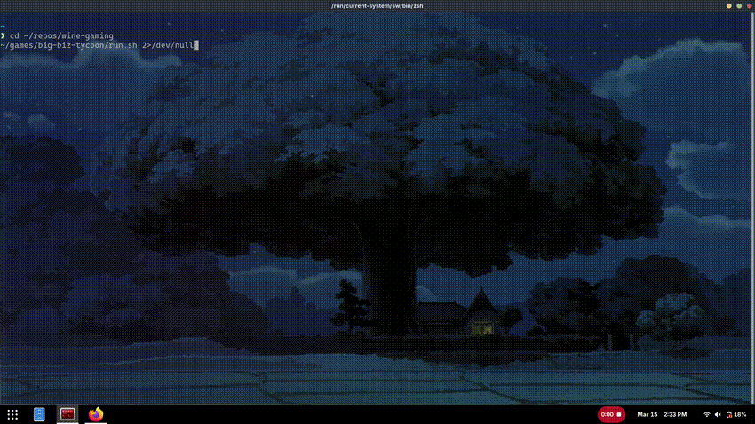

# wine-gaming

General-purpose workspace for running Windows games with Wine on Linux.

Exemplar game I ran using wine on NixOS (Windows 2002 era ~ I played as a
kid called Big Biz Tycoon; I still have the CD and everything!):


<div align="center">
  
</div>

## Goals

- Keep Wine tooling in one reproducible environment
- Use game-specific launch scripts instead of one shared global Wine prefix
- Keep per-game fixes documented alongside each game

## Environment setup

```bash
cd ~/repos/wine-gaming
direnv allow
```

If you are not using direnv, run the game scripts from whatever shell provides
your required Wine packages.

## Recommended layout

- Game launchers live in each game directory (for example: `~/games/<game>/run.sh`)
- Each game keeps its own Wine prefix (for example: `~/games/<game>/wineprefix/`)
- Game-specific notes live in `~/games/<game>/README.md`

This avoids cross-game breakage from shared DLLs, registry settings, or drive mappings.

## Running a game

From the `wine-gaming` environment, run that game's launcher script:

```bash
~/games/<game>/run.sh
```

## Troubleshooting checklist

- Confirm the launcher is using the intended `WINEPREFIX`
- Check drive mappings in `<prefix>/dosdevices/`
- Ensure required runtime dependencies are available in the active shell
- Run the launcher directly in terminal to capture Wine errors
